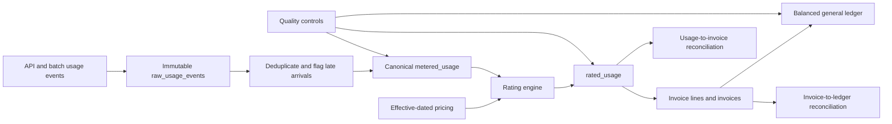

# AI Usage Metering to Revenue Platform

An auditable reference implementation that converts AI API and token-usage events into rated charges, customer invoices, balanced general-ledger entries, and penny-accurate reconciliations.

The repository demonstrates the core data-platform problem behind usage-based AI monetization:

`usage event → deduplication → metering → effective-dated pricing → invoice → revenue journal → reconciliation`

## Current delivery: 78%

The completed 78% is runnable and tested:

- Immutable raw-event ingestion with payload hashes and source timestamps
- Exactly-once business processing through deterministic event-ID deduplication
- Late and out-of-order event retention with explicit late-arrival flags
- Effective-dated model pricing for input and output tokens
- Canonical metered-usage and rated-usage models
- Customer invoice lines and finalized monthly invoices
- Double-entry journals for Accounts Receivable and Usage Revenue
- Usage-to-invoice and invoice-to-ledger penny-level reconciliation
- Persisted quality-control and reconciliation evidence
- Idempotent rebuilds, transactional transformations, automated tests, and CI

See [Future scope](docs/FUTURE_SCOPE.md) for the remaining 22% required to make this a production-scale platform.

## Architecture



For design decisions, grains, invariants, and production mappings, see [Architecture](docs/ARCHITECTURE.md).

## Quick start

Requirements: Python 3.11+

```bash
python -m venv .venv
source .venv/bin/activate
pip install -e ".[dev]"
metering-pipeline
pytest
```

On Windows PowerShell:

```powershell
python -m venv .venv
.\.venv\Scripts\Activate.ps1
pip install -e ".[dev]"
metering-pipeline
pytest
```

The demo intentionally includes one duplicate and one event received more than 24 hours late. The output is written to `data/output/run_summary.json`.

Expected control results:

```json
{
  "raw_events": 4,
  "unique_metered_events": 3,
  "duplicate_events_removed": 1,
  "late_events": 1,
  "invoices": 2
}
```

All five quality controls and both financial reconciliations must return `PASS`.

## Data products

| Data product | Grain | Purpose |
|---|---|---|
| `raw_usage_events` | ingestion attempt | Immutable source evidence |
| `metered_usage` | unique usage event | Canonical billable usage |
| `rated_usage` | rated usage event | Effective price and charge |
| `invoice_lines` | invoice and model | Explainable invoice detail |
| `invoices` | customer and month | Final customer obligation |
| `general_ledger` | journal and account | Balanced financial posting |
| `quality_results` | run and control | Audit evidence |
| `reconciliation_results` | run and tie-out | Financial correctness |

## Correctness guarantees

1. Every business event is metered at most once by `event_id`.
2. Every metered event must match exactly one effective price.
3. Token counts and monetary charges cannot be negative.
4. Invoice totals must equal the sum of rated usage.
5. Usage Revenue credits must equal finalized invoice totals.
6. Every journal must balance debits and credits.
7. Re-running transformations produces the same financial outputs.

## Repository structure

```text
src/monetization_pipeline/pipeline.py  Pipeline, controls, and CLI
tests/test_pipeline.py                 Correctness and idempotency tests
docs/ARCHITECTURE.md                   Design, contracts, and trade-offs
docs/FUTURE_SCOPE.md                   Remaining production scope
.github/workflows/ci.yml               Automated validation
```

## Technology mapping

This local implementation uses Python and DuckDB so reviewers can run it without cloud credentials. The production design maps immutable ingestion to Kafka and object storage, transformations to dbt on Snowflake, and control evidence to Great Expectations or an equivalent quality service.

## License

MIT
